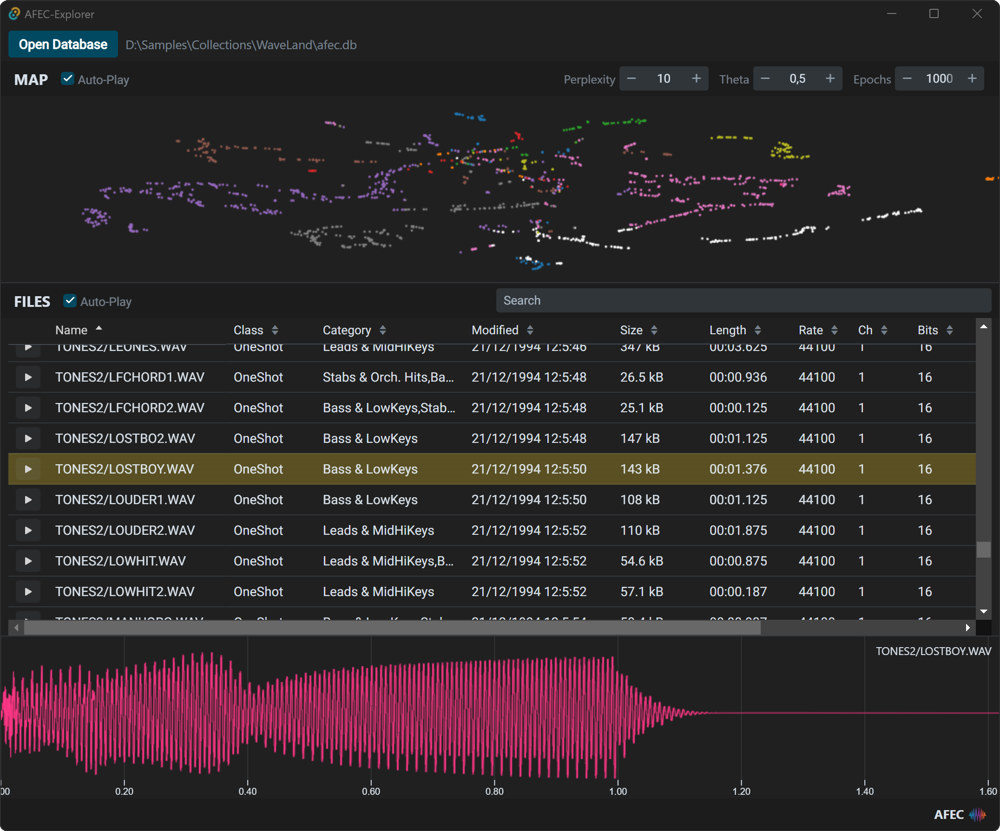

# AFEC-Explorer

This repository contains an experimental GUI for browsing [AFEC](https://github.com/emuell/AFEC) *high-level* databases using [Tauri](https://tauri.app).

## Features

- Shows high-level features of an AFEC high-level database in a grid.
- Shows a 2d t-SNE cluster from the afec high-level classification data.
- Hovering or clicking on a file in the grid or t-SNE map plays the audio file.
- Simple file name based searching / filtering.

*Please note:* The explorer only consumes AFEC database file - it does not generate them. 
You can generate `afec.db` files with [AFEC](https://github.com/emuell/AFEC)'s crawler app first.

## Development

### Requirements

- Tauri: Rust and a C++ Compiler - see [Tauri's Prerequisites](https://tauri.app/v1/guides/getting-started/prerequisites)
- NPM: Download at [Node.js](https://nodejs.org/en/)

### Building

- Install node dependencies via `npm install`
- Build and run a **development** build with hot-reloading: `npm run tauri dev`
- Build a **production** binary: `npm run tauri build`
